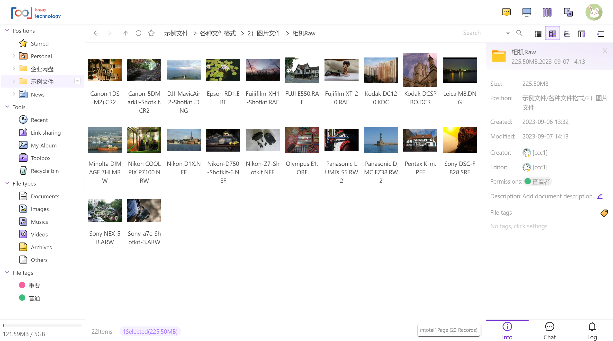
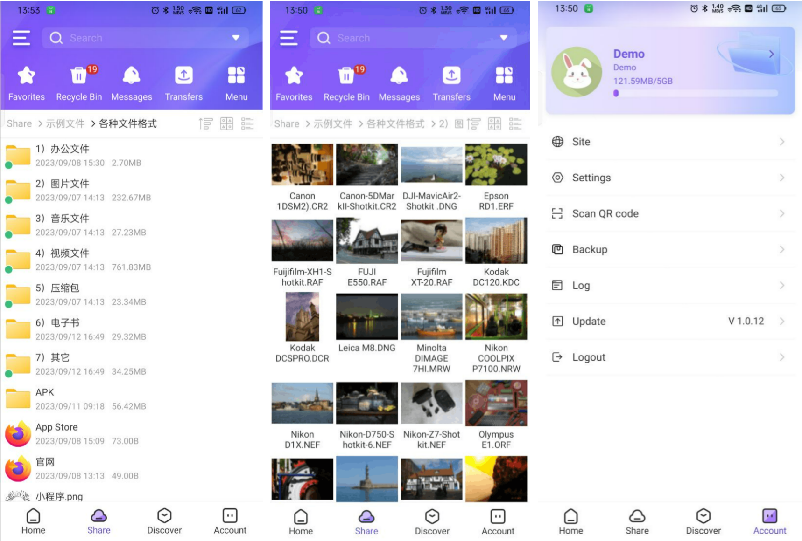

## Introduce 
Filesbox is a powerful file manager , which you can view & edit a lot of kinds of  files, including office files, pictures, vidoes in web browser. It also offer iOS \ Android APP and WeChat mini program. The server can run either online or locally on Linux


Demo site: [https://demo.filesbox.cn](https://demo.filesbox.cn)

Account & password: Demo / Demo123

中文网站: [https://www.filesbox.cn](https://www.filesbox.cn)

**Features**

- Account Management
- Roles and Privilege Management
- Files Management, Move/Copy/Clone/Delete files
- Preview pictures & Camera raws
- Preview office docs
- Play music & videos
- Preview zips, online zip & unzip
- Share folders & files with password
- Capture Screen & Record video
- iOS \ Android APP \ WeChat mini program


# Screenshot

File Manager

Pictures

Videos 

Video Editor

APP


Backend


### Install

1. Install from source


```
git clone git@github.com:wujihulian/filesbox.git
chmod -RF 777 ./filesbox/*
```


2. Install via download


```
wget https://codeload.github.com/wujihulian/filesbox/zip/refs/heads/master
unzip filesbox-master.zip
chomd -Rf 777 ./*
```


**Contact**
Email: 6267294@qq.com


